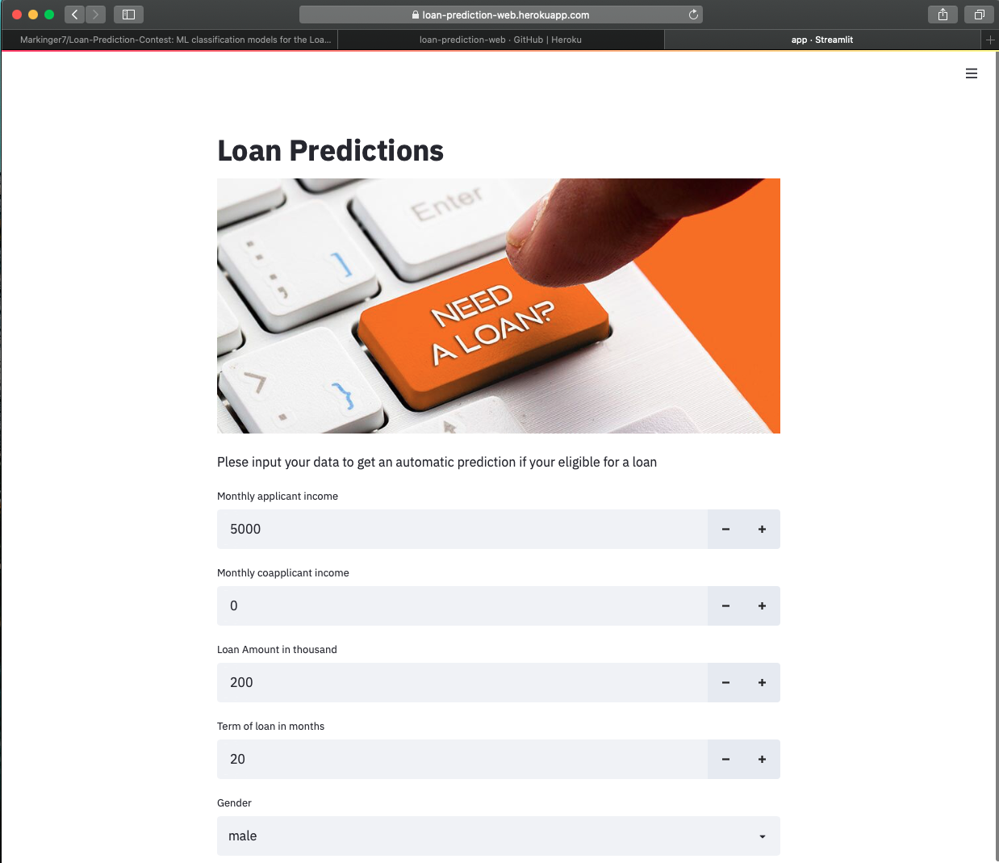
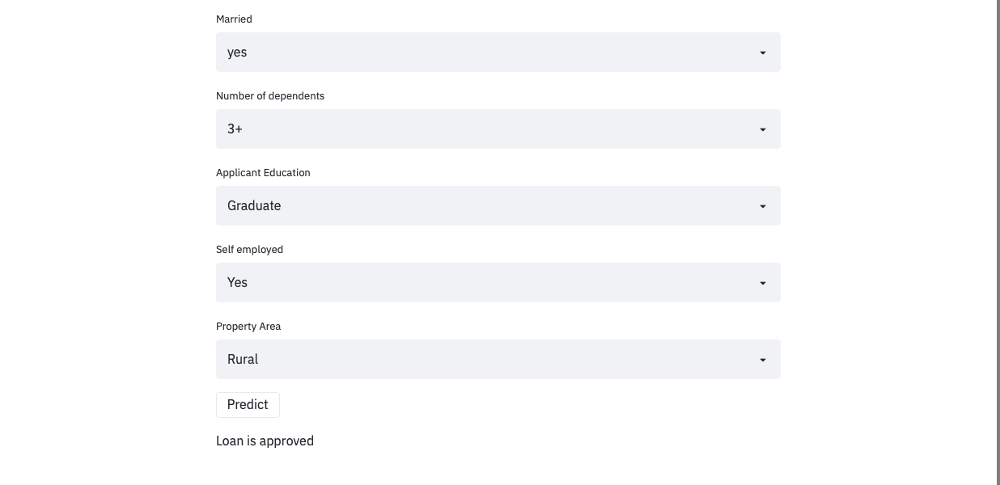

# Loan-Prediction-contest
Repo containing code for the Loan Prediction Practice Problem from <a href='https://datahack.analyticsvidhya.com/contest/practice-problem-loan-prediction-iii/#About'> Analytics Vidhya</a>.

After completing the contetst I decided to use the trained model and make a web app where users can check if they are eligible for a loan.
<a href='https://loan-prediction-web.herokuapp.com'>Link</a> to web app.

### Description from the contest:
This hackathon aims to provide a professional setup to showcase your skills and compete with their peers, learn new things and achieve a steep learning curve.

### Problem
#### Predict Loan Eligibility for Dream Housing Finance company

Dream Housing Finance company deals in all kinds of home loans. They have presence across all urban, semi urban and rural areas. Customer first applies for home loan and after that company validates the customer eligibility for loan.

Company wants to automate the loan eligibility process (real time) based on customer detail provided while filling online application form. These details are Gender, Marital Status, Education, Number of Dependents, Income, Loan Amount, Credit History and others. To automate this process, they have provided a dataset to identify the customers segments that are eligible for loan amount so that they can specifically target these customers. 

### What did I do?
- EDA: explored the different features and checked effect on the variable of interest (loan_status)
- Cleaning: filled missing values
- Feature Engineering: created three new features from the numeric variables
- Model:
  - tested the folloing classifiers: LogisticRegression, KNeighborsClassifier, SVC, DecisionTreeClassifier, RandomForestClassifier, AdaBoostClassifier, GradientBoostingClassifier and xgboost
  - LogisticRegression and AdaBoostClassifier performed the best (used cros validation to check consistency of both classifers)
  - Hyperparameter Tuning for LogisticRegression
- Final Model: LogisticRegression
  - C=100
  - max_iter=50
- Final Score in the contest: 0.78

### To-Do
- use SMOTE for upsampling to get better predictions
- use ensamble leraning to enhace score

## Web app based on trained model
I used streamlit to make the web app and Heroku to make it accessible without running the app locally.

### Deployed model on Heroku with streamlit

### How to access
On the web
- <a href='https://loan-prediction-web.herokuapp.com'>Link</a> to web app

Locally
1. set working dict to the folder
2. make sure you have activated your environment with the necessary libaries 
3. type `streamlit run app.py` in your terminal

### Files
- Loan_Prediction.ipynb: Jupyter Notebook containing the python code
- Procfile: provides startup instructions to the webserver
- app.py: python code for the web app
- final_class.sav: final classifier to predict loan eligibility
- loan.jpg: picture for the web app
- requirements.txt: file telling the environment which packages should be installed
- setup.sh: used to create the necessary environment for the streamlit app
- submission_1.csv: csv file containing the predicted classes for the contest 

### Python libaries
- numpy
- pandas
- matplotlib
- seaborn
- sklearn
- streamlit

### Resources
- https://towardsdatascience.com/build-and-deploy-machine-learning-web-app-using-pycaret-and-streamlit-28883a569104
